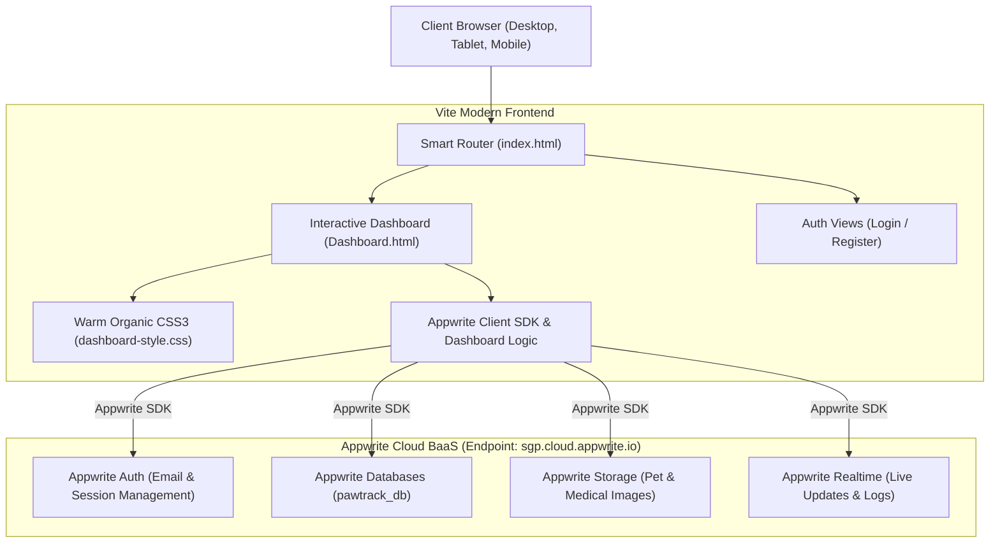

<div align="center">

# 🐾 PawTrack

### *Next-Generation Intelligent Pet Care, Adoption Management, Vet Scheduling & Companion Ecosystem*

[](https://vitejs.dev/)
[](https://appwrite.io/)
[](https://developer.mozilla.org/en-US/docs/Web/JavaScript)
[](LICENSE)

<p align="center">
  <strong>A modern, serverless platform powered by Vite & Appwrite Cloud.</strong><br>
  Built with a warm, natural, and friendly design system tailored for pet parents, rescue shelters, adopters, and veterinarians.
</p>

---

</div>

## 📑 Table of Contents
- [Overview](#-overview)
- [System Architecture](#-system-architecture)
- [Design System & Aesthetics](#-design-system--aesthetics)
- [Key Features](#-key-features)
- [Repository Structure](#-repository-structure)
- [Getting Started](#-getting-started)
- [Appwrite Cloud Setup](#-appwrite-cloud-setup)
- [Deployment](#-deployment)
- [License](#-license)

---

## 🌟 Overview

**PawTrack** is an all-in-one digital companion animal hub designed to replace fragmented pet management workflows. Whether matching prospective pet parents with rescue animals, coordinating veterinary appointments, browsing the pet supply store, or chatting in real-time, PawTrack provides an intuitive, warm, and responsive experience.

The application runs as a **pure modern client-side architecture** built with **Vite** and backed by **Appwrite Cloud** for Authentication, Document Databases, Storage, and Realtime sync.

---

## 🏗 System Architecture



---

## 🌿 Design System & Aesthetics

PawTrack uses the **"Warm Companion & Natural Haven"** design system:
- **Warm Linen Canvas** (`#FAF8F5`): Soft, natural cream background with subtle ambient radial warmth.
- **Terracotta Coral** (`#E85D3B`): Warm, inviting calls to action that evoke affection and energy.
- **Botanical Forest Sage** (`#2E6F56`): Health status chips, veterinary trust badges, and wellness cards.
- **Golden Honey Amber** (`#F59E0B`): Compatibility match rings, star ratings, and treat badges.
- **Espresso Charcoal** (`#1F2421`): High-contrast, gentle typography replacing harsh jet-black.
- **Fluid & Responsive**: Built with modern CSS Grid and Flexbox with no fixed zoom locks, scaling smoothly from 4K down to mobile smartphones.

---

## 🚀 Key Features

1. **Meet the Pets Catalog**: Species filters (`🐶 Dogs`, `🐱 Cats`, `🐰 Small Pets`, `🦜 Birds`), edge-to-edge curved imagery, floating gender/age chips, and full personality details drawer.
2. **Adoption Journey Tracker**: 4-stage adoption stepper (*Submitted ➔ Under Review ➔ Home Check ➔ Approved*) with direct contact and status indicators.
3. **Vet Appointments Hub**: Registered pet selector, Doctor Carousel with star ratings and verified credentials, date/time slot picker, and digital appointment passes.
4. **Pet Shop Hub & Slide-out Cart**: Free shipping promotional banner, category filters, quick-add to cart, item counters, and checkout calculation.
5. **Match Maker**: Swipeable pet card deck, circular compatibility ring (e.g., *94% Match*), and celebration modals.
6. **Profile & 30-Day Recycle Bin**: Avatar customization, dual pet roster (private companions vs. public adoptions), and holding bin with 1-click restore.
7. **Floating Messenger**: Floating action button (FAB) with pulse unread indicator, slide-up messenger dialog, contact list with online statuses, and instant message dispatcher.

---

## 📁 Repository Structure

```
pawtrack/
├── pawtrack_frontend/           # Vite application & Appwrite SDK workspace
│   ├── public/                  # Static assets (stylesheets, icons, images)
│   │   ├── dashboard-style.css  # Warm organic design system stylesheet
│   │   └── style.css            # Authentication stylesheet
│   ├── appwrite.js              # Appwrite SDK client initialization
│   ├── appwrite.json            # Appwrite database & collection schema specification
│   ├── setup-db.ps1             # PowerShell automated Appwrite collection deployment
│   ├── setup-db.js              # Node.js Appwrite schema generator
│   ├── dashboard.js             # Dashboard application controller & event logic
│   ├── script.js                # Auth & account creation handler
│   ├── vite.config.js           # Multi-page Vite configuration
│   ├── Dashboard.html           # Main dashboard interface
│   ├── PawTrackLogin.html       # Login page
│   ├── CreateAccount.html       # Register page
│   └── index.html               # Entry router
├── dist/                        # Production build output
├── package.json                 # Top-level workspace script runner
└── README.md                    # Project documentation
```

---

## ⚡ Getting Started

### Prerequisites
- **Node.js 18+** & **npm**
- **Git**

### Installation & Local Development

1. **Clone the repository**:
   ```bash
   git clone https://github.com/REP-Julian/pawtrack.git
   cd pawtrack
   ```

2. **Install dependencies**:
   ```bash
   npm install
   ```

3. **Start the Vite development server**:
   ```bash
   npm run dev
   ```
   Open your browser at `http://localhost:5173/` (or the port displayed in your terminal).

4. **Build for production**:
   ```bash
   npm run build
   ```

5. **Preview production build locally**:
   ```bash
   npm run preview
   ```

---

## ☁️ Appwrite Cloud Setup

PawTrack connects directly to Appwrite Cloud. To deploy the database schema to your Appwrite project:

1. **Install the Appwrite CLI** (optional, or use npx):
   ```bash
   npm install -g appwrite-cli
   ```

2. **Login to your Appwrite account**:
   ```bash
   appwrite login
   ```

3. **Deploy the database & collections**:
   ```bash
   cd pawtrack_frontend
   npx appwrite-cli deploy collection
   ```
   *Alternatively, run the automated PowerShell script:*
   ```powershell
   cd pawtrack_frontend
   .\setup-db.ps1
   ```

### Pre-configured Collections in `pawtrack_db`:
- `pets`: Pet roster, breeds, health status, photos, and adopter information.
- `applications`: Adoption request forms, review status, and user associations.
- `vet_appointments`: Doctor bookings, clinic times, and pet IDs.
- `recycle_bin`: Soft-deleted pets with 30-day restore capability.
- `activity_logs`: User activity timeline and notification stream.

---

## 🌐 Deployment

### Deploying to Appwrite Sites
1. In the [Appwrite Console](https://cloud.appwrite.io/), navigate to your project and open **Hosting / Sites**.
2. Connect your GitHub repository.
3. Configure build settings:
   - **Root directory**: `pawtrack_frontend`
   - **Build command**: `npm run build`
   - **Output directory**: `dist`
4. Deploy! Appwrite will assign a live domain with automatic SSL.

### Deploying to Vercel / Netlify / Cloudflare Pages
Since PawTrack compiles to a pure static bundle in `pawtrack_frontend/dist`, you can also deploy to any modern edge host:
- Set build command to: `cd pawtrack_frontend && npm run build`
- Set publish directory to: `pawtrack_frontend/dist`

---

## 📄 License

Distributed under the **MIT License**. See `LICENSE` for more information.

<div align="center">
  <sub>Made with ❤️ for animals and the people who love them.</sub>
</div>
