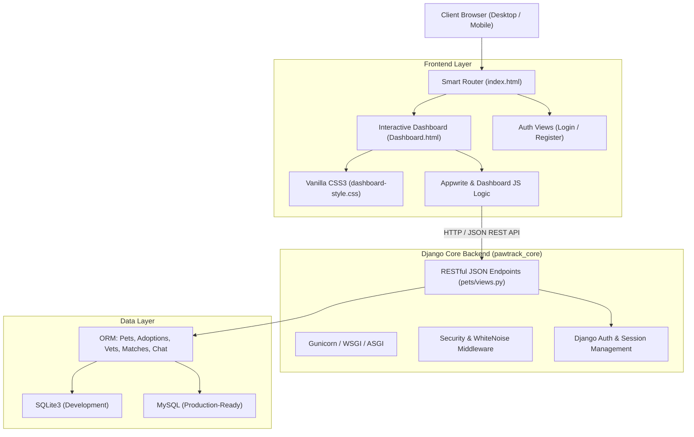
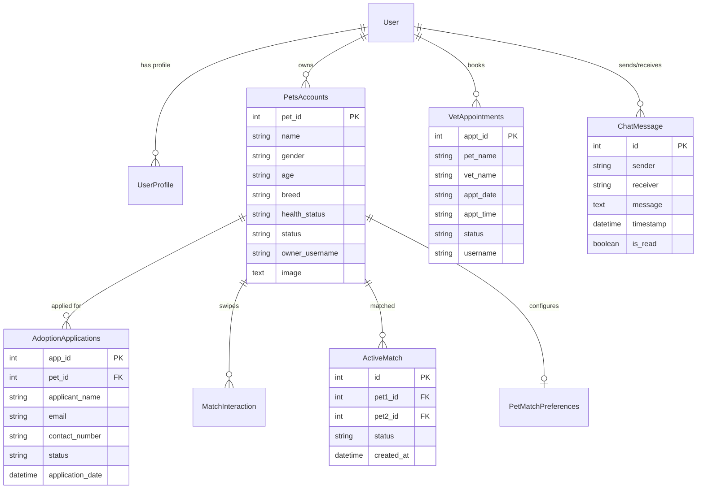

<div align="center">

# 🐾 PawTrack

### *Next-Generation Intelligent Pet Care, Adoption Management, Breeding Tracker & Community Ecosystem*

[](https://www.djangoproject.com/)
[](https://www.python.org/)
[](https://vitejs.dev/)
[](https://developer.mozilla.org/en-US/docs/Web/JavaScript)
[](https://sqlite.org/)
[](LICENSE)

<p align="center">
  <strong>A modern, full-stack platform designed for pet parents, shelters, adopters, veterinarians, and ethical breeders.</strong><br>
  Manage pet health, streamline adoptions, schedule vet visits, find breeding or playmate matches, and chat in real-time.
</p>

---

</div>

## 📑 Table of Contents
- [Overview](#-overview)
- [System Architecture](#-system-architecture)
- [Key Features & Capabilities](#-key-features--capabilities)
  - [1. Pet Profiles & Life-Cycle Management](#1-pet-profiles--life-cycle-management)
  - [2. Adoption Workflow Engine](#2-adoption-workflow-engine)
  - [3. Veterinary Appointments & Healthcare](#3-veterinary-appointments--healthcare)
  - [4. Match Maker (Pet Dating & Breeding Compatibility)](#4-match-maker-pet-dating--breeding-compatibility)
  - [5. PawTrack Messenger (In-App Direct Chat)](#5-pawtrack-messenger-in-app-direct-chat)
  - [6. Breeding Pairs & Litter History Tracker](#6-breeding-pairs--litter-history-tracker)
  - [7. Pet Shop & Supplies Hub](#7-pet-shop--supplies-hub)
  - [8. Security, Authentication & Access Control](#8-security-authentication--access-control)
  - [9. Django Administration Suite](#9-django-administration-suite)
- [API Reference](#-api-reference)
- [Data Models & Schema](#-data-models--schema)
- [Repository Structure](#-repository-structure)
- [Getting Started](#-getting-started)
  - [Prerequisites](#prerequisites)
  - [Backend Setup (Django)](#backend-setup-django)
  - [Frontend Setup (Vite / Appwrite Workspace)](#frontend-setup-vite--appwrite-workspace)
- [Environment Variables & Configuration](#-environment-variables--configuration)
- [Deployment](#-deployment)
- [Contributing](#-contributing)
- [License](#-license)

---

## 🌟 Overview

**PawTrack** is an all-in-one digital pet care hub designed to solve the fragmented experience of managing companion animals. Whether connecting rescue shelters with eager adopters, assisting owners with veterinary bookings, helping reputable breeders maintain careful lineage and litter records, or enabling pet matchmaking with integrated real-time messaging, PawTrack provides a unified, elegant, and secure platform.

The system features a **dual-architecture setup**:
1. **Full-Stack Django Application**: Complete with dynamic ORM models, session-based authentication, CSRF-hardened JSON APIs, WhiteNoise asset compression, and Django Admin.
2. **Vite & Modern Frontend**: Fast modular builds, static asset distribution, responsive glassmorphism UI, and optional Appwrite Cloud integration.

---

## 🏗 System Architecture



---

## 🚀 Key Features & Capabilities

### 1. Pet Profiles & Life-Cycle Management
- **Detailed Bio Cards**: Register and showcase pets with name, breed, age, gender, medical/health status, personality traits, background stories, and photos.
- **Smart Image Decoder**: Built-in backend image decoder supporting memoryview buffers, Base64 strings, and fallback dynamic avatar generation.
- **Status Lifecycle**: Manage visibility with statuses: `Available`, `Pending`, `Archived`, and `Private`.
- **Recycle Bin & Safe Soft-Deletion**:
  - Move pets to the recycle bin without losing underlying data.
  - **Built-in safety lock**: Prevents moving a pet to the bin if there is an active adoption application linked to that specific pet.
  - Ownership validation ensures users can only archive or delete pets they personally registered.
  - Restoring pets brings them instantly back into the public catalog.
  - Permanent cleanup with "Empty Bin" functionality.

### 2. Adoption Workflow Engine
- **Digital Application Submission**: Prospective pet parents can submit comprehensive adoption requests directly through pet profile cards.
- **Information Captured**: Applicant name, contact number, email, address, residence type (house/apartment/condo), and existing pet history.
- **Automated Catalog Locking**: Automatically shifts a pet's status to `Pending` upon application submission to prevent duplicate applications.
- **Application Dashboard ("My Applications")**: Real-time status tracker for users to monitor pending, approved, or reviewed adoptions.
- **Application Cancellation**: Allows applicants to withdraw their application, which automatically resets the pet's status back to `Available`.

### 3. Veterinary Appointments & Healthcare
- **Digital Appointment Booking**: Schedule veterinary check-ups by specifying pet name, designated veterinarian, preferred appointment date, and time slot.
- **Appointment Status Tracking**: Monitor status (`Pending Review`, `Confirmed`, `Completed`) in a dedicated tab.
- **Cancellation Flow**: Cancel or reschedule upcoming appointments with a single click.

### 4. Match Maker (Pet Dating & Breeding Compatibility)
- **Interactive Card Swiping**: Swipe Right (Like), Swipe Left (Pass), or send a **Super Treat** to standout candidates.
- **Targeted Candidate Algorithm**:
  - Automatically identifies candidate pets of the opposite gender listed with `Private` status.
  - Excludes the user's own pets and any pets previously swiped on.
- **Multi-Vector Compatibility Scoring**:
  - Computes **Size Match**, **Energy Match**, and **Temperament Score**.
  - Generates an aggregate overall compatibility percentage.
- **Super Treats Wallet**:
  - Users receive a daily refill of 3 Super Treats to highlight their interest.
  - Wallet balance and recharge timestamps are tracked in `UserProfile`.
- **Two-Stage Mutual Match Flow**:
  - Initial swipe sets status to `pending`.
  - Mutual like or acceptance upgrades match to `approved`, unlocking the in-app chat.

### 5. PawTrack Messenger (In-App Direct Chat)
- **Floating Action Launcher (FAB)**: Quick-access floating messenger button with an animated unread badge.
- **Conversation Inbox**: Displays active conversation threads, recent message snippets, message timestamps, and unread counters.
- **1-on-1 Messaging**: Fast exchange of direct messages between matched pet owners.
- **Read Receipts**: Automatically flags incoming messages as read upon viewing the conversation.

### 6. Breeding Pairs & Litter History Tracker
- **Active Breeding Pairs (`ActiveBreedingPairs`)**:
  - Relational mapping of dam (female) and sire (male) pets.
  - Tracks pairing dates, expected due dates, estimated litter size, and cycle status.
- **Litter History (`LitterHistory`)**:
  - Records litter birth dates, puppy/kitten counts, survival metrics, and adoption availability for every litter.

### 7. Pet Shop & Supplies Hub
- **Care Essentials Marketplace**: Built-in shop section featuring pet nutrition, toys, grooming products, supplements, and accessories.

### 8. Security, Authentication & Access Control
- **User Authentication**: Django user system with hashed passwords and secure sessions.
- **Profile Management**: Extends default users with `UserProfile` for phone number, treat wallets, and role data.
- **Invite Key System (`InviteKeys`)**: Controlled onboarding mechanism to verify new account registration.
- **API Guard**: Custom `@login_required_json` decorator ensuring JSON APIs return clean `401 Unauthorized` responses instead of HTML redirects.
- **CSRF & Cookie Protection**: Session cookies with configurable `SESSION_COOKIE_SECURE`, `CSRF_COOKIE_SECURE`, and `X_FRAME_OPTIONS`.

### 9. Django Administration Suite
- Full-featured backoffice dashboard at `/admin/` with custom `ModelAdmin` views:
  - Custom filters by status, breed, gender, and role.
  - Fast search capabilities across pet names, owners, emails, and usernames.
  - Paginated data tables and preview snippets for messages and audit logs.

---

## 🔌 API Reference

### Authentication & Profile
| Method | Endpoint | Description | Auth Required |
| :--- | :--- | :--- | :---: |
| `POST` | `/api/register/` | Register a new user account and user profile | No |
| `POST` | `/api/login/` | Authenticate user and initiate session | No |
| `GET` | `/api/logout/` | Terminate active user session and redirect | Yes |
| `POST` | `/api/update-profile/`| Update user first name, last name, email, and contact number | Yes |

### Pet Management
| Method | Endpoint | Description | Auth Required |
| :--- | :--- | :--- | :---: |
| `POST` | `/api/pets/register/` | Register a new pet under the authenticated user | Yes |
| `POST` | `/api/pets/move-to-bin/` | Soft-delete a pet to the recycle bin (Archive) | Yes |
| `POST` | `/api/pets/restore/` | Restore an archived pet back to `Available` | Yes |
| `POST` | `/api/pets/empty-bin/` | Permanently remove all archived pets owned by user | Yes |

### Adoptions
| Method | Endpoint | Description | Auth Required |
| :--- | :--- | :--- | :---: |
| `POST` | `/api/adoption/submit/` | Submit an adoption application for a specific pet | No / Optional |
| `POST` | `/api/adoption/cancel/` | Cancel an active adoption application and restore pet | Yes |

### Vet Appointments
| Method | Endpoint | Description | Auth Required |
| :--- | :--- | :--- | :---: |
| `POST` | `/api/vet/book/` | Book a clinic appointment for a pet | Yes |
| `POST` | `/api/vet/cancel/` | Cancel an existing veterinary appointment | Yes |

### Match Maker & Messenger
| Method | Endpoint | Description | Auth Required |
| :--- | :--- | :--- | :---: |
| `POST` | `/api/match/candidates/` | Fetch eligible opposite-gender candidates with match scores | Yes |
| `POST` | `/api/match/swipe/` | Record swipe action (`like`, `pass`, `super_like`) | Yes |
| `GET` | `/api/match/active/` | Retrieve current matches (pending and approved) | Yes |
| `POST` | `/api/match/update-status/` | Accept or remove a match interaction | Yes |
| `GET` | `/api/chat/inbox/` | Fetch recent conversation threads with unread counts | Yes |
| `POST` | `/api/chat/messages/` | Retrieve chronological chat history with a specific user | Yes |
| `POST` | `/api/chat/send/` | Send a direct message to a matched owner | Yes |

---

## 🗄 Data Models & Schema



---

## 📁 Repository Structure

```
pawtrack/
├── pawtrack_core/               # Django project root configuration
│   ├── asgi.py                  # ASGI deployment entry point
│   ├── settings.py              # Application settings, WhiteNoise, Logging
│   ├── urls.py                  # Global URL routing table
│   └── wsgi.py                  # WSGI production entry point
├── pets/                        # Main Django application
│   ├── admin.py                 # Django admin interface configuration
│   ├── models.py                # Database models (Pets, Adoptions, Chat, Matches)
│   ├── views.py                 # Core business logic & API endpoint controllers
│   ├── static/                  # Static assets (CSS, images, icons)
│   └── templates/               # Server-rendered HTML templates
│       ├── Dashboard.html       # Primary application dashboard
│       ├── PawTrackLogin.html   # Login interface
│       └── CreateAccount.html   # Account registration interface
├── pawtrack_frontend/           # Vite / Frontend workspace
│   ├── src/                     # Source modules
│   ├── package.json             # Frontend dependencies (Vite, Appwrite SDK)
│   ├── vite.config.js           # Multi-page build configuration
│   ├── appwrite.js              # Appwrite Cloud client initialization
│   └── dashboard.js             # Client-side state & UI controllers
├── dist/                        # Production web bundle build
├── db.sqlite3                   # Local development SQLite database
├── manage.py                    # Django management script
├── package.json                 # Workspace build script orchestration
└── requirements.txt             # Python dependencies
```

---

## ⚡ Getting Started

### Prerequisites
Make sure you have the following installed on your machine:
- **Python 3.10+**
- **Node.js 18+** & **npm**
- **Git**

---

### Backend Setup (Django)

1. **Clone the repository**:
   ```bash
   git clone https://github.com/REP-Julian/pawtrack.git
   cd pawtrack
   ```

2. **Create and activate a virtual environment**:
   - **Windows (PowerShell)**:
     ```powershell
     python -m venv venv
     .\venv\Scripts\Activate.ps1
     ```
   - **macOS / Linux**:
     ```bash
     python3 -m venv venv
     source venv/bin/activate
     ```

3. **Install Python dependencies**:
   ```bash
   pip install -r requirements.txt
   ```

4. **Apply database migrations**:
   ```bash
   python manage.py migrate
   ```

5. **Create a superuser (for admin access)**:
   ```bash
   python manage.py createsuperuser
   ```

6. **Start the Django development server**:
   ```bash
   python manage.py runserver
   ```
   Open your browser and navigate to `http://127.0.0.1:8000/`.
   - **Dashboard**: `http://127.0.0.1:8000/dashboard/`
   - **Admin Portal**: `http://127.0.0.1:8000/admin/`

---

### Frontend Setup (Vite / Appwrite Workspace)

If you wish to run or compile the client-side frontend independently:

1. **Install root & workspace dependencies**:
   ```bash
   npm install
   ```

2. **Run frontend in development mode**:
   ```bash
   npm --prefix pawtrack_frontend run dev
   ```

3. **Build production bundles**:
   ```bash
   npm run build
   ```

---

## ⚙️ Environment Variables & Configuration

You can configure the application behavior via environment variables in your environment or a `.env` file:

| Variable | Default Value | Description |
| :--- | :--- | :--- |
| `DJANGO_SECRET_KEY` | *(insecure dev fallback)* | Cryptographic secret key for session signing |
| `DJANGO_DEBUG` | `True` | Set to `False` in production environments |
| `DJANGO_ALLOWED_HOSTS` | `localhost,127.0.0.1` | Comma-delimited list of permitted host headers |

---

## 🚀 Deployment

- **WSGI Production**: PawTrack is pre-configured with `gunicorn` in `requirements.txt`. Run with:
  ```bash
  gunicorn pawtrack_core.wsgi:application --bind 0.0.0.0:8000
  ```
- **Static Assets**: Handled cleanly in production using `WhiteNoise` with manifest compression:
  ```bash
  python manage.py collectstatic --noinput
  ```
- **Appwrite Sites / Static Hosting**: The repository includes build scripts (`npm run build`) that bundle the multi-page frontend directly into `dist/` and repository root for static hosting.

---

## 🤝 Contributing

Contributions, issues, and feature requests are welcome!
1. Fork the Project
2. Create your Feature Branch (`git checkout -b feature/AmazingFeature`)
3. Commit your Changes (`git commit -m 'feat: Add AmazingFeature'`)
4. Push to the Branch (`git push origin feature/AmazingFeature`)
5. Open a Pull Request

---

## 📄 License

Distributed under the **MIT License**. See `LICENSE` for more information.

<div align="center">
  <sub>Made with ❤️ for animals and the people who love them.</sub>
</div>
